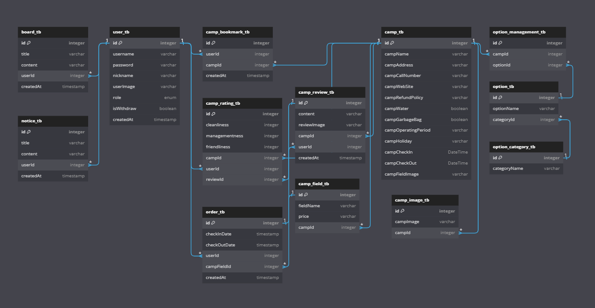

# YAYoung 팀 프로젝트

## 목차
- [프로젝트 소개](#프로젝트-소개)
- [시연영상](#시연-영상)
- [기술스택](#기술스택)
- [화면구성](#화면구성)
- [ERD](#erd)
- [API명세서](#API명세서)
- [일정관리](#일정관리)
- [보완할 점](#보완할-점)
- [느낀 점](#느낀-점)

## 프로젝트 소개

### 팀원
- 박세환 (팀장, 플러터) [](https://github.com/bbarkse93)
- 김대욱 (플러터) [](https://github.com/saki8661)
- 김승신 (스프링) [](https://github.com/seunggod)
- 김언약 (플러터) [](https://github.com/yakyakyak12)
- 남은혜 (스프링) [](https://github.com/muaga)
- 전우진 (스프링) [](https://github.com/m40ro)

### 프로젝트 기간
- 2024년 1월 3일 ~ 2024년 1월 19일 (16일 간)

### 어플 설명
YaYoung은 캠핑장의 정보를 한눈에 볼 수 있고 일정을 등록해서 관리할 수 있으며 리뷰를 통해 다른 사람의 평가를 확인 할 수 있는 캠핑장 앱으로써 해당 앱을 클론 코딩 했습니다.

## 시연 영상
[](https://www.youtube.com/watch?v=DnakjiCeETY&t=14s)

https://github.com/bbarkse93/project-yayoung-flutter/assets/135561618/85171b99-c839-4303-a5db-e949a1457619

## 구현 기능

### 유저 관련 기능
- 소셜 로그인 (휴대폰 로컬에 jwt 저장)
- 로그아웃
- 개인정보 수정
- 회원탈퇴
- 공지사항 및 FAQ 조회

### 캠핑장 관련 기능
- 옵션별 캠핑장 목록 보기 (필터링)
- 캠핑장 리뷰 달기 (리뷰)
- 캠핑장 검색 기능 (검색)
- 캠핑장 예약(결제) / 취소(환불)
- 다가 오는 캠핑장 확인 (일정관리)
- 다녀온 캠핑장 확인
- 캠핑장 북마크
- 캠핑장 위치 연결(지도)
- 캠핑장 전화 연결
- 캠핑장 웹사이트 연결

## 기술스택

### Backend
 

 

 


### Frontend
 


 


 


### IDE
 

### 협업도구
     

### 데이터베이스
 

### Dependencies
```java
implementation group: 'com.auth0', name: 'java-jwt', version: '4.4.0'
implementation 'org.springframework.boot:spring-boot-starter-aop'
implementation 'org.springframework.boot:spring-boot-starter-validation'
implementation 'org.springframework.boot:spring-boot-starter-data-jpa'
implementation 'org.springframework.boot:spring-boot-starter-web'
compileOnly 'org.projectlombok:lombok'
developmentOnly 'org.springframework.boot:spring-boot-devtools'
runtimeOnly 'com.h2database:h2'
runtimeOnly 'com.mysql:mysql-connector-j'
annotationProcessor 'org.projectlombok:lombok'
implementation 'org.springframework.boot:spring-boot-starter-mustache'
testImplementation 'org.springframework.boot:spring-boot-starter-test'
testImplementation 'org.springframework.restdocs:spring-restdocs-mockmvc'
implementation 'javax.servlet:jstl:1.2'
implementation group: 'com.google.code.gson', name: 'gson', version: '2.10.1'
```

## 화면구성
[](https://www.figma.com/file/Ptkc7WCoBYO1di2kKHL7Z4/YAYoung?type=design&mode=design&t=Pxxgh3MPpkGZiqRn-0)


## ERD
[](https://dbdiagram.io/d/yayoung-6595042bac844320ae252152)



## API명세서
[](https://paper-danthus-c42.notion.site/1-d1049a409e494da0a0cb1475f7978c13?pvs=4)

## 일정관리
[](https://paper-danthus-c42.notion.site/1-d1049a409e494da0a0cb1475f7978c13?pvs=4)


## 보완할 점

- 예약된 날짜 빼고 화면에 데이터 전달 
- 개인정보 수정 오류 수정하기 
- 자동로그인, 회원탈퇴, 로그아웃 
- 이미지 보관 용량 줄이는 방법 알아보기 
- 베포

## 느낀 점

- API문서는 Rest Docs를 도입하여 백엔드와 프론트엔드 간의 협업을 진행했습니다. 이전 웹/앱 프로젝트에서 사용하지 못한 것을 아쉬워했던 부분이었습니다. 코드에 대한 테스트 작성이 필요한 작업이 귀찮았지만, 작은 단위 테스트를 통해 오류를 발견할 수 있는 장점이 있었습니다.
  또한, 테스트 코드와 결과 값이 일치하지 않으면 파일이 생성되지 않는 점은 문서의 신뢰성을 높일 수 있었습니다. 이러한 점들이 매우 유익했습니다.
- 백엔드에서 프론트엔드로 데이터를 전달하기 위해 Stream API를 사용해 보았습니다. DTO를 통해 매개변수로 받은 List를 분해하고 필터링, 맵 등을 통해 가공해서 가공된 데이터를 DTO안 DTO에 담아
  화면에 필요한 데이터만 전달하는 그 과정이 너무 신기하고 재밌었던거 같습니다.
- ORM 프레임워크인 Spring Data JPA(Java Persistence API)를 사용해보았습니다. 이전 프로젝트에서 사용했던 MyBatis와의 차이점은
  직접 SQL을 작성하지 않고도 CRUD작업을 수행할 수 있다는 것과 JPA 어노테이션을 사용해 클래스와 데이터베이스간의 매핑을 정의할 수 있었습니다.
  자동으로 연관관계가 있는 클래스를 조회하다보니 복잡한 쿼리나 대량의 데이터를 처리하는 등 중요한 상황에서는 직접 SQL을 작성하는 것이 호율적일수 있다는 생각이 들었고,
  MyBatis를 사용했을때보다 작업 시간을 줄일 수 있어 좋았습니다.
- session기반 인증 시스템은 확장이 어렵고 자바스크립트에서 jsessionId에 접근 할 수 없다는 단점이 있습니다. 그래서 JWT 토큰 인증을 사용해서 프로젝트를 진행하였습니다.
  로그인 시에 JWT를 생성(암호화)하여 인증, 인가를 하였고 JWT에 인증에 필요한 데이터가 관리 되어있기 때문에 별도의 저장소가 없어도 데이터를 관리할 수 있다는 장점과
  session과 달리 서버는 StateLess상태로 관리할 수 있어서 확정성이 좋다는 장점을 확인할 수 있어서 너무 좋았습니다.
- 아키택처는 MVC 패턴을 사용하여 Model - View - Controller 각각의 역할을 분리하여 관리자 페이지를 만들었습니다. 장점은 코드의 가독성이 좋아졌고 유지 관리가 수월하였던 점과
  코드의 재사용이 높고, 독립적인 개발, 수정, 테스트를 할 수 있다는 장점이 있었고 코드를 보며 이해할 수 있어서 좋았습니다.
